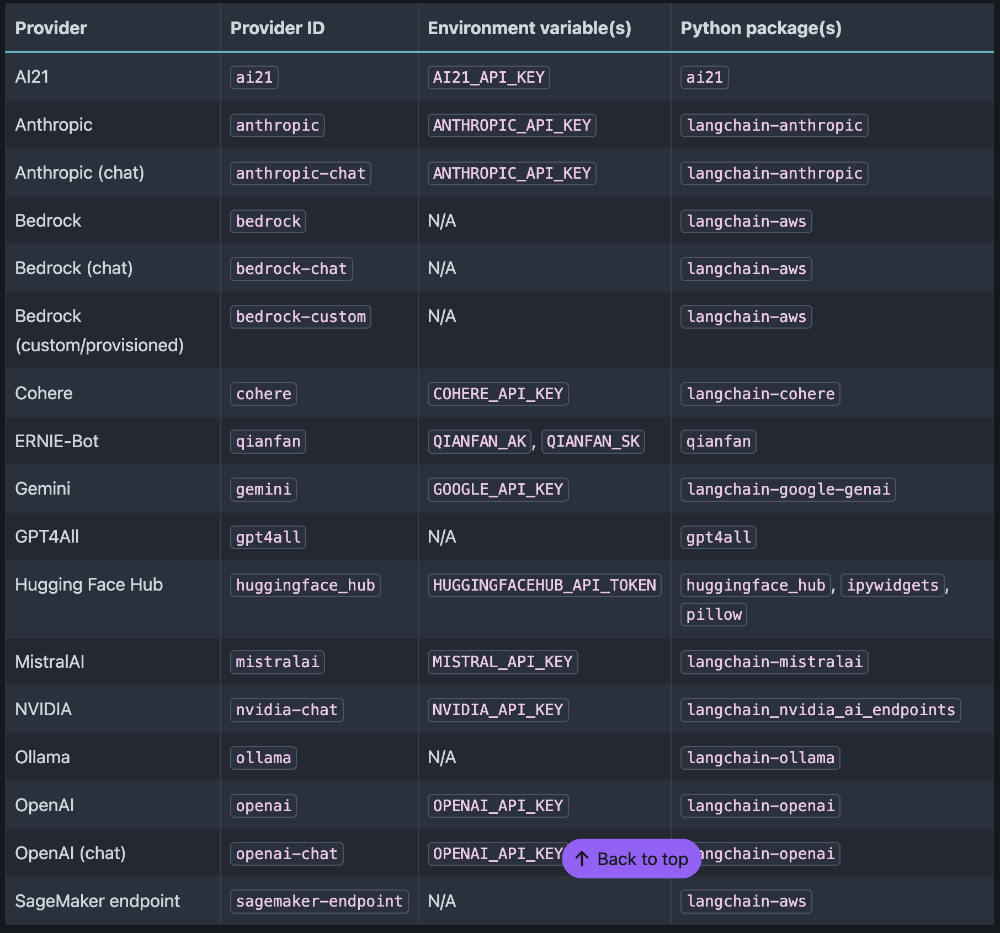

# jupyter-ai-introduction
Sample code to introduce jupyter ai extension

## Documentation

You can fine the model providers [here](https://jupyter-ai.readthedocs.io/en/latest/users/index.html#model-providers).

Each time you see Python packages associated to a model provider, this means that you need to install them for teh extension to properly works.

For example, in this tutorial we want to setup Ollama and gemini as this can be used for free. In addition to install `jupyter-ai`, you need to install `langchain-ollama` along with `numpy<2.0` and `langchain-google-genai`.